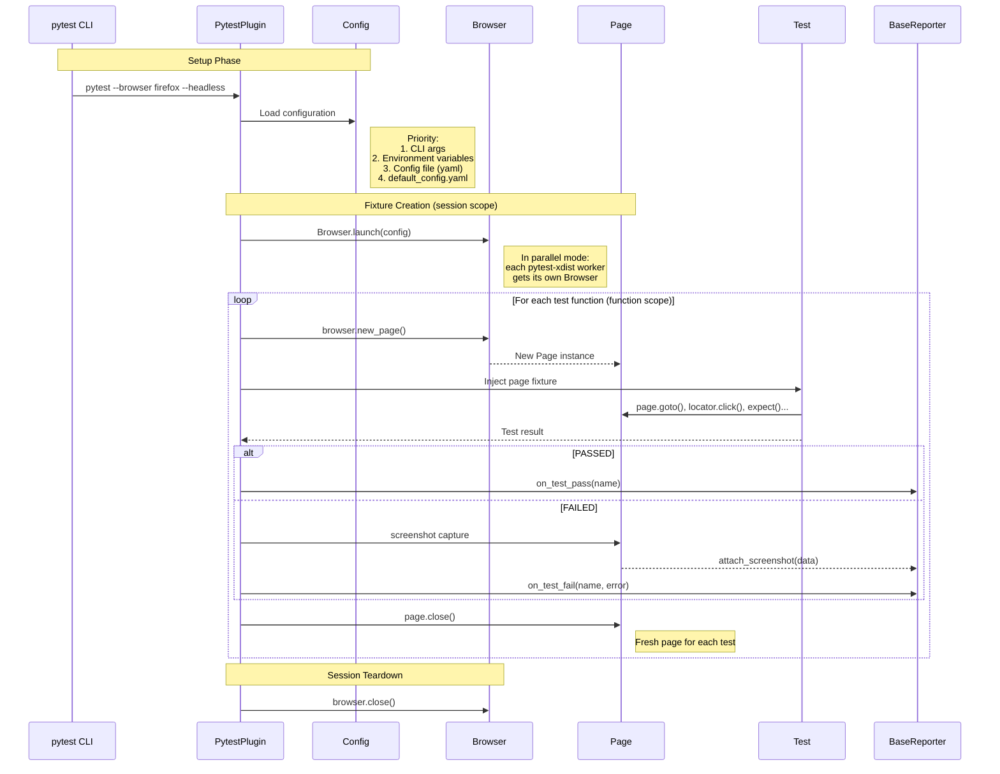

```mermaid
sequenceDiagram
    participant CLI as pytest CLI
    participant Plugin as PytestPlugin
    participant Config
    participant Browser
    participant Page
    participant Test
    participant Reporter as BaseReporter

    Note over CLI,Config: Setup Phase
    CLI->>Plugin: pytest --browser firefox --headless
    Plugin->>Config: Load configuration
    Note right of Config: Priority:<br/>1. CLI args<br/>2. Environment variables<br/>3. Config file (yaml)<br/>4. default_config.yaml

    Note over Plugin,Page: Fixture Creation (session scope)
    Plugin->>Browser: Browser.launch(config)
    Note right of Browser: In parallel mode:<br/>each pytest-xdist worker<br/>gets its own Browser

    loop For each test function (function scope)
        Plugin->>Browser: browser.new_page()
        Browser-->>Page: New Page instance

        Plugin->>Test: Inject page fixture
        Test->>Page: page.goto(), locator.click(), expect()...
        Test-->>Plugin: Test result

        alt PASSED
            Plugin->>Reporter: on_test_pass(name)
        else FAILED
            Plugin->>Page: screenshot capture
            Page-->>Reporter: attach_screenshot(data)
            Plugin->>Reporter: on_test_fail(name, error)
        end

        Plugin->>Page: page.close()
        Note right of Page: Fresh page for each test
    end

    Note over Plugin,Browser: Session Teardown
    Plugin->>Browser: browser.close()
```
