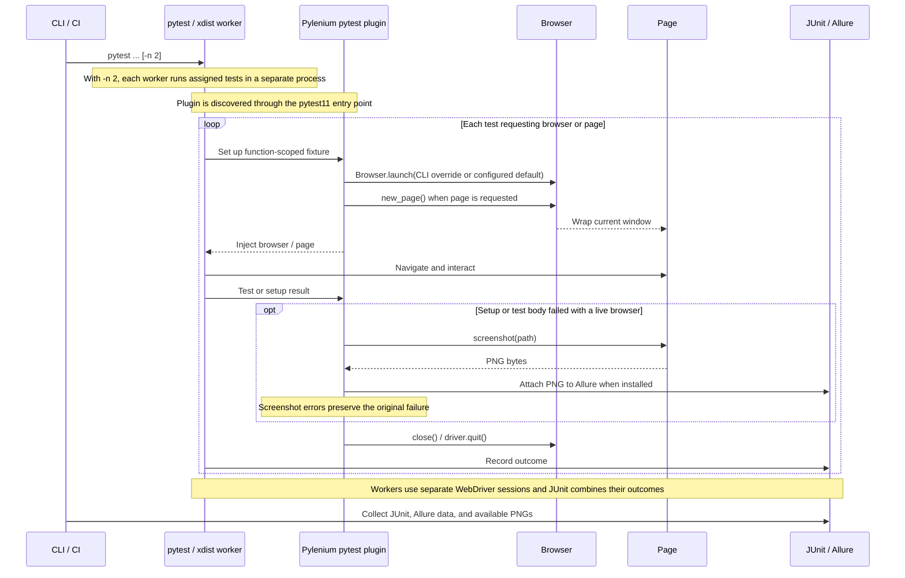

# Test lifecycle

```mermaid
sequenceDiagram
    participant Runner as CLI / CI
    participant Pytest as pytest / xdist worker
    participant Plugin as Pylenium pytest plugin
    participant Browser
    participant Page
    participant Results as JUnit / Allure

    Runner->>Pytest: pytest ... [-n 2]
    Note over Pytest: With -n 2, each worker runs assigned tests in a separate process
    Note over Pytest,Plugin: Plugin is discovered through the pytest11 entry point

    loop Each test requesting browser or page
        Pytest->>Plugin: Set up function-scoped fixture
        Plugin->>Browser: Browser.launch(CLI override or configured default)
        Plugin->>Browser: new_page() when page is requested
        Browser-->>Page: Wrap current window
        Plugin-->>Pytest: Inject browser / page
        Pytest->>Page: Navigate and interact
        Pytest->>Plugin: Test or setup result

        opt Setup or test body failed with a live browser
            Plugin->>Page: screenshot(path)
            Page-->>Plugin: PNG bytes
            Plugin->>Results: Attach PNG to Allure when installed
            Note over Plugin: Screenshot errors preserve the original failure
        end

        Plugin->>Browser: close() / driver.quit()
        Pytest->>Results: Record outcome
    end

    Note over Pytest,Results: Workers use separate WebDriver sessions and JUnit combines their outcomes
    Runner->>Results: Collect JUnit, Allure data, and available PNGs
```
