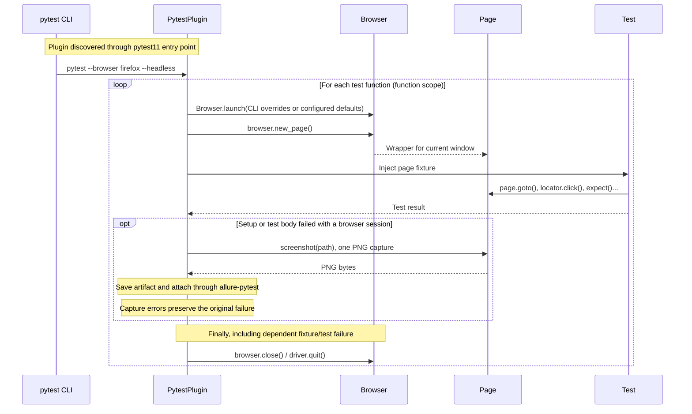

```mermaid
sequenceDiagram
    participant CLI as pytest CLI
    participant Plugin as PytestPlugin
    participant Browser
    participant Page
    participant Test

    Note over CLI,Plugin: Plugin discovered through pytest11 entry point
    CLI->>Plugin: pytest --browser firefox --headless

    loop For each test function (function scope)
        Plugin->>Browser: Browser.launch(CLI overrides or configured defaults)
        Plugin->>Browser: browser.new_page()
        Browser-->>Page: Wrapper for current window

        Plugin->>Test: Inject page fixture
        Test->>Page: page.goto(), locator.click(), expect()...
        Test-->>Plugin: Test result

        opt Setup or test body failed with a browser session
            Plugin->>Page: screenshot(path), one PNG capture
            Page-->>Plugin: PNG bytes
            Note over Plugin: Save artifact and attach through allure-pytest
            Note over Plugin: Capture errors preserve the original failure
        end

        Note over Plugin,Browser: Finally, including dependent fixture/test failure
        Plugin->>Browser: browser.close() / driver.quit()
    end

```
