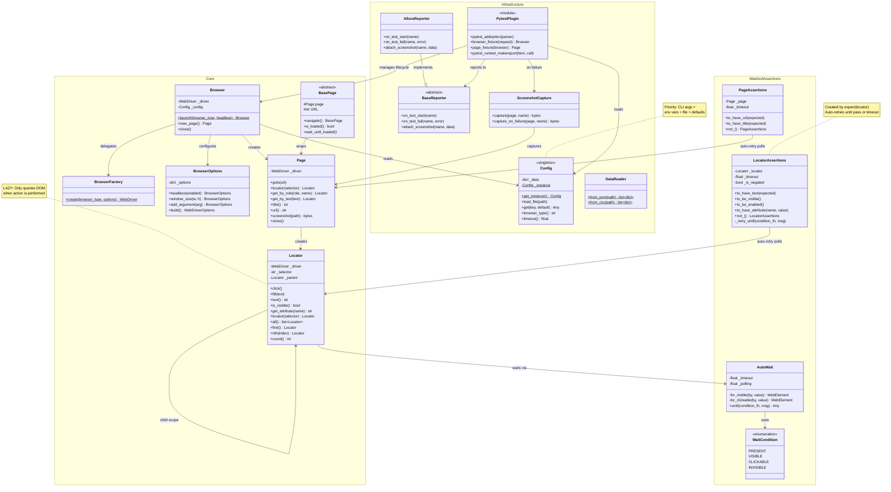

```mermaid
classDiagram
    direction TB

    namespace Core {
        class Browser {
            -WebDriver _driver
            -Config _config
            +launch(browser_type, headless)$ Browser
            +new_page() Page
            +close()
        }

        class BrowserFactory {
            +create(browser_type, options)$ WebDriver
        }

        class BrowserOptions {
            -dict _options
            +headless(enabled) BrowserOptions
            +window_size(w, h) BrowserOptions
            +add_argument(arg) BrowserOptions
            +build() WebDriverOptions
        }

        class Page {
            -WebDriver _driver
            +goto(url)
            +locator(selector) Locator
            +get_by_role(role, name) Locator
            +get_by_text(text) Locator
            +title() str
            +url() str
            +screenshot(path) bytes
            +close()
        }

        class Locator {
            -WebDriver _driver
            -str _selector
            -Locator _parent
            +click()
            +fill(text)
            +text() str
            +is_visible() bool
            +get_attribute(name) str
            +locator(selector) Locator
            +all() list~Locator~
            +first() Locator
            +nth(index) Locator
            +count() int
        }

        class BasePage {
            <<abstract>>
            #Page page
            #str URL
            +navigate() BasePage
            +is_loaded() bool
            +wait_until_loaded()
        }
    }

    namespace WaitAndAssertions {
        class AutoWait {
            -float _timeout
            -float _polling
            -for_visible(by, value) WebElement
            -for_clickable(by, value) WebElement
            +until(condition_fn, msg) Any
        }

        class WaitCondition {
            <<enumeration>>
            PRESENT
            VISIBLE
            CLICKABLE
            INVISIBLE
        }

        class LocatorAssertions {
            -Locator _locator
            -float _timeout
            -bool _is_negated
            +to_have_text(expected)
            +to_be_visible()
            +to_be_enabled()
            +to_have_attribute(name, value)
            +not_() LocatorAssertions
            -_retry_until(condition_fn, msg)
        }

        class PageAssertions {
            -Page _page
            -float _timeout
            +to_have_url(expected)
            +to_have_title(expected)
            +not_() PageAssertions
        }
    }

    namespace Infrastructure {
        class Config {
            <<singleton>>
            -dict _data
            -Config _instance$
            +get_instance()$ Config
            +load_file(path)
            +get(key, default) Any
            +browser_type() str
            +timeout() float
        }

        class BaseReporter {
            <<abstract>>
            +on_test_start(name)
            +on_test_fail(name, error)
            +attach_screenshot(name, data)
        }

        class AllureReporter {
            +on_test_start(name)
            +on_test_fail(name, error)
            +attach_screenshot(name, data)
        }

        class ScreenshotCapture {
            +capture(page, name) bytes
            +capture_on_failure(page, name) bytes
        }

        class PytestPlugin {
            <<module>>
            +pytest_addoption(parser)
            +browser_fixture(request) Browser
            +page_fixture(browser) Page
            +pytest_runtest_makereport(item, call)
        }

        class DataReader {
            +from_json(path)$ list~dict~
            +from_csv(path)$ list~dict~
        }

    }

    Browser --> BrowserFactory : delegates
    Browser --> BrowserOptions : configures
    Browser --> Page : creates
    Browser --> Config : reads
    Page --> Locator : creates
    Locator --> AutoWait : waits via
    Locator --> Locator : child scope
    AutoWait --> WaitCondition : uses
    BasePage --> Page : wraps

    LocatorAssertions --> Locator : auto-retry polls
    PageAssertions --> Page : auto-retry polls

    AllureReporter --|> BaseReporter : implements
    ScreenshotCapture --> Page : captures

    PytestPlugin --> Browser : manages lifecycle
    PytestPlugin --> Config : loads
    PytestPlugin --> ScreenshotCapture : on failure
    PytestPlugin --> BaseReporter : reports to

    note for Locator "LAZY: Only queries DOM
    when action is performed"
    note for LocatorAssertions "Created by expect(locator)
    Auto-retries until pass or timeout"
    note for Config "Priority: CLI args >
    env vars > file > defaults"
```
