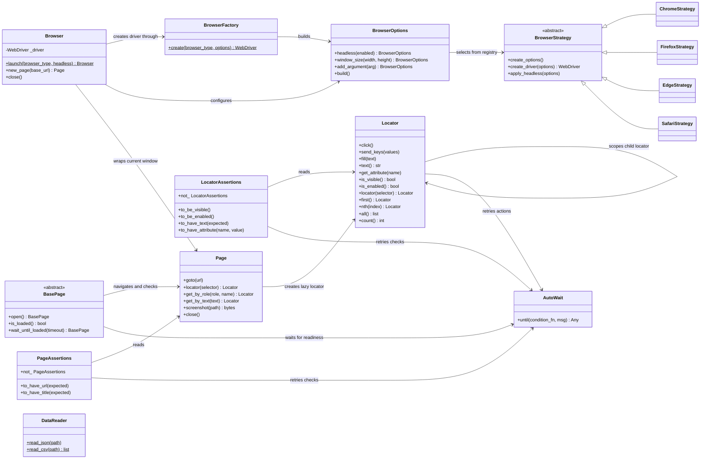

# Implemented relationships

The pytest plugin is a module, not a class. It owns function-scoped browser/page
fixtures and captures failure screenshots. pytest-xdist runs these fixtures in
separate worker processes; GitHub Actions and Jenkins invoke pytest and collect
JUnit, Allure, and screenshot artifacts. `DataReader` is independent of the
browser and assertion classes.
